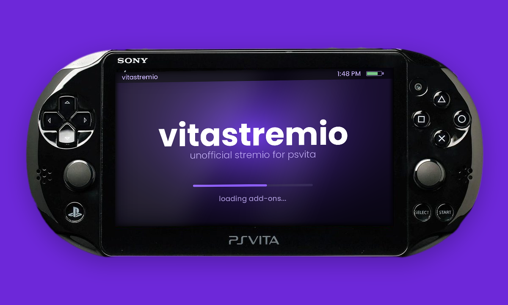

<p align="center">
  
</p>

# vitastremio

A native PlayStation Vita client for Stremio, backed by a small companion
service (`middleware.py`) that does everything the Vita cannot. No Stremio
server required — addons are enough on their own.

Browse your Stremio catalogs — movies and TV series — search, filter by
genre, pick an episode and a source, and watch: on a handheld from 2011,
with hardware-decoded video, working audio, subtitles, audio track selection
and touch controls.


---

## How it works

The Vita is a 2011 handheld and cannot run Stremio itself — it isn't fast
enough, and it can't even connect securely to modern addons.

So it doesn't try. You run a small helper program on a computer at home, and
that computer does the hard work: it fetches everything, converts the video
into a form the Vita can play, and sends it over your home network. The Vita
just shows the menus and plays what arrives. Windows, Mac and Linux all work.

```
        Stremio addons  (catalogs, artwork, streams)
                              |
        direct link           |          torrent
              |               |             |
              |               |     Stremio server   <- optional, see below
              |               |             |
              +---------------+-------------+
                              |
                       helper program        on your computer
                              |
                              |  video and audio over your home network
                              v
                          PS Vita
```

Two things to set up, then: the helper program on a computer, and the app on
the Vita.

### You probably do not need a Stremio server

The names here are confusing, so to be clear: **the helper program is not the
Stremio server, and most people never need the Stremio server at all.**

**Addons are the whole system.** They provide your catalogs, artwork,
subtitles and the actual video links. The helper program talks to them
directly. That is the normal setup, and there is nothing else to install.

**The Stremio server only downloads torrents.** Some addons hand back a
torrent instead of a normal video link, and torrents have to be downloaded
before anything can play them. That is the one job it does.

If your addons give back normal links — anything using a debrid service does,
and so do addons that host their own content — then no torrents are involved
and the Stremio server would sit there doing nothing.

You can always add it later if you run into an addon that needs it. See
[Watching without a Stremio server](#watching-without-a-stremio-server).

---

## Features

- Browse and search your Stremio catalogs
- Movies and TV series, with an episode picker for shows
- Switch between movies and series and filter by genre — press TRIANGLE
  on the catalog
- Pick from a list of sources, with resolution, size and language shown
- Smooth full-screen video with proper audio
- Subtitles, from your Stremio subtitle addons
- Choose the audio track on releases that have more than one
- Touch and button controls, seek bar, pause, skip 30 seconds
- Audio sync adjustment if a source needs it — see [fixing out-of-sync audio](#fixing-out-of-sync-audio)
- Change which computer it connects to from the Vita itself, so it works
  away from home too
- Add and manage addons from a web page, on any device

---

## Setting it up

### What sort of computer you need

Almost anything. It needs **Python** and **ffmpeg**, both of which run on
Windows, macOS and Linux.

| | |
|---|---|
| Operating system | Windows, macOS or Linux |
| Software | Python 3 and ffmpeg |
| Network | Connected to the same home network as the Vita |

Converting video is the demanding part, so it will use your graphics chip
if it can:

- **Linux** with Intel or AMD graphics — uses the graphics chip
- **Mac** — uses the graphics chip
- **Anything else**, including Windows — falls back to the processor

The fallback works fine, it just uses a lot more of your computer while
something is playing. You don't have to choose; it checks at startup and
picks the best option available.

An old desktop or a cheap mini PC is plenty. A Raspberry Pi or similar small
board will struggle, since it has no supported graphics chip and a weak
processor.

### 1. Set up the computer

Install Python and ffmpeg.

**Windows** — the easiest way is winget, in PowerShell:

```powershell
winget install Python.Python.3.12
winget install Gyan.FFmpeg
```

**macOS** — with [Homebrew](https://brew.sh):

```bash
brew install python ffmpeg
```

**Linux** — pick the line for your distribution:

```bash
sudo apt install -y ffmpeg python3          # Ubuntu / Debian
sudo dnf install -y ffmpeg python3          # Fedora
sudo pacman -S ffmpeg python                # Arch
```

Then start it:

```bash
python3 middleware.py
```

Leave it running — that's the program the Vita talks to. It prints which
video converter it settled on when it starts. If it says it's using software,
everything still works; it will just use more of your processor.

**Using Docker?** On Linux, add the `--device` line so it can reach the
graphics chip. Without it you'll get the software fallback, which is fine but
slower:

```bash
docker run -d --name vitastremio \
  --device /dev/dri:/dev/dri \
  -p 8480:8480 \
  vitastremio
```

**On a NAS?** Models with Intel processors work well. ARM models will fall
back to software and may be too slow to keep up.

**Playback stuttering?** The processor probably can't convert fast enough.
Either pick a lower-quality source, or tell it to prioritise speed:

```bash
X264_PRESET=ultrafast python3 middleware.py
```

It normally picks the best encoder by itself, but you can force one with
`VITA_ENCODER=vaapi`, `VITA_ENCODER=videotoolbox` or `VITA_ENCODER=x264` —
handy for checking how the software path behaves on a machine that has a
working GPU encoder.

### 2. Add your addons

On any computer or phone, open a browser and go to
`http://<address-of-that-computer>:8480/`

This page is where you add addons — paste in the addon links you want, or
sign in with a Stremio account key to bring across the ones you already have.

Your addons decide what you can actually watch, so this step matters. Most
work straight away; the ones that don't are covered in
[Watching without a Stremio server](#watching-without-a-stremio-server).

### 3. Install the app on the Vita

Download `vitastremio.vpk` from the
[latest release](https://github.com/gmorb/vitastremio/releases/latest),
copy it to your Vita and install it with VitaShell. Open it, and it will ask
for the address of the computer you set up in step 1. Enter it once and it
remembers.

That's everything. More detail if you need it: [BUILD.md](BUILD.md).

---

## Fixing out-of-sync audio

Some sources arrive with the sound slightly ahead of or behind the picture.
There's a hidden screen for correcting that while the video keeps playing.

It's hidden on purpose — the buttons it uses are ones you'd otherwise hit by
accident during a film.

**To open it: hold SELECT and press TRIANGLE while something is playing.**
The same combination closes it again.

| Button | What it does |
|---|---|
| Up | Moves the picture later, a millisecond at a time |
| Down | Moves the picture earlier |
| Hold Up or Down | Speeds up, so you can cover a large gap quickly |
| SELECT + TRIANGLE | Close |

Watch the middle line of text while you adjust. The number labelled **sync**
is the one to care about: it's how far out things currently are. Get it as
close to zero as you can and leave it there. The number labelled **trim** is
simply how much you've adjusted by — zero means untouched.

Nudge in one direction and see whether **sync** gets closer to zero or further
away. If it's getting worse, go the other way. You can go up to 500ms in
either direction, which is far more than any normal source needs. To start
over, bring **trim** back to zero.

Once you've set it, it stays set while you skip around or move on to something
else. It resets when you close the app.

The other numbers on that screen are there for diagnosing playback problems.
The top row counts how evenly frames are arriving — if it turns orange, the
video is stuttering, and that's usually a sign the computer is struggling or
the network is congested rather than anything to do with sync.

**If the sound drifts further out as the video goes on**, rather than being
off by a steady amount, this screen won't help. That means the computer can't
keep up with converting the video. Try a lower-quality source.

---

## Watching without a Stremio server

Most people never need the Stremio server. This section explains when that's
true and what to expect.

Addons hand back one of two things when you pick something to watch: either a
normal link the computer can just open, or a torrent. Torrents have to be
downloaded before they can play, and downloading them is the only thing the
Stremio server does. Normal links skip it entirely.

**Works without it**

- Addons set up with a debrid service — Real-Debrid, AllDebrid, Premiumize and
  similar. These turn torrents into normal links before they ever reach you,
  which is exactly what's needed here.
- Addons that host their own content

**Needs it**

- Addons that hand back plain torrents with no debrid service attached

**What to do**

Nothing. There's no setting to change. Add your addons and go — if none of
them use torrents, the Stremio server never comes into it.

**One thing to watch for:** the Vita can't tell the two kinds of source apart,
so torrent sources still appear in the list and simply fail if you pick one.
If most sources in a list fail, that addon is handing back torrents. Either
add a debrid service to it, or set up a Stremio server.

---

## Watching away from home

You can take the Vita away and still watch from your own computer at home.
It needs one extra piece of hardware, for a reason worth understanding
first.

### Why you need a travel router

The Vita has no way to connect back to your home network by itself. It has
no VPN support of any kind, and no app can add it — the vitastremio app can
only use the Vita's ordinary networking.

So instead of connecting the Vita to your home network, you bring a small
router with you that is already connected to it. The Vita joins that
router's Wi-Fi like any normal hotspot, and the router carries everything
home for it.

A pocket travel router is the piece you need. The GL.iNet ones are the usual
choice: they are about the size of a deck of cards, run off a USB battery,
and have the software for this built in.

```
   Vita  ---Wi-Fi--->  travel router  ---internet--->  computer at home
                       (with you)                      (running Tailscale)
```

### Setting it up

**1. On the home computer**, install [Tailscale](https://tailscale.com) and
sign in. It is free for personal use.

```bash
# Linux
curl -fsSL https://tailscale.com/install.sh | sh
sudo tailscale up
```

On Windows and Mac, download the installer from their site and sign in.

Then get the address it has been given:

```bash
tailscale ip -4
```

It looks like `100.86.4.21`. Write it down — that is the address the Vita
will use from now on, at home and away.

**2. On the travel router**, turn on Tailscale in its admin page and sign in
with the same account. On GL.iNet routers this is under Applications.

There will also be a setting that lets devices on the router's Wi-Fi use the
Tailscale connection, rather than only the router itself. It has to be
turned on or the Vita won't get through. The wording varies between models
and firmware versions, so check your router's documentation for what it
calls it.

**3. On the Vita**, connect to the travel router's Wi-Fi, open vitastremio,
and change the computer's address to the Tailscale one from step 1.

**4. Test it before you leave.** Do all of the above at home, while
everything is still on your own Wi-Fi, and play something. If it works
there, it will work in a hotel. Working this out in a hotel room — where you
cannot tell whether the problem is the router, the account or the hotel's
Wi-Fi — is genuinely unpleasant.

Once it is set up, nothing changes when you travel. Same Wi-Fi name, same
address, and the Vita cannot tell the difference.

### Will your connection carry it?

Video and audio together need about **4 Mbit per second, steadily**. The
audio is uncompressed, which is deliberate — the Vita is too slow to decode
compressed audio — but it means the sound alone accounts for roughly a
quarter of that.

The thing that limits you is your **home upload speed**, not the download
speed wherever you happen to be. Home connections usually have far less
upload than download, so look up that number specifically. Below about
5 Mbit up, expect stuttering.

If it is borderline, lower the video bitrate. In `middleware.py` near
the top, change `VID_BITRATE` and `VID_MAXRATE` to something like `1200k`
and `1500k`. The picture is softer, but it holds together on a weaker
connection.

### Don't forward the port instead

It is tempting to skip the router and just forward port 8480 on your home
router. Don't.

The helper program has no password on it, by design — it was built for a
home network. Forwarding it puts your addon list, your Stremio account
details if you imported them, and a free video stream out of your home
connection in front of anyone who scans for open ports. Tailscale avoids
that: only your own signed-in devices can reach it, and nothing is visible
from the open internet.

---

## Things it can't do

- **Subtitles only work in Latin alphabets.** The Vita's built-in font has no
  Cyrillic, Greek, Arabic, Chinese, Japanese or Korean characters, so those
  come out as boxes.
- **Some sources need the sync adjusting.** Most are fine as they are — see
  [fixing out-of-sync audio](#fixing-out-of-sync-audio).
- **Skipping takes a couple of seconds.** The video has to be re-prepared from
  the new position each time.
- **One Vita at a time.** A second Vita needs its own copy of the program
  running.
- **Away from home needs a travel router.** The Vita has no VPN support, so
  something else has to make the connection for it. See
  [watching away from home](#watching-away-from-home).
- **4K sources are a waste.** Everything is shrunk to fit the Vita's screen, so
  a 1080p source looks identical and uses far less bandwidth.
- **Windows PCs convert video with the processor**, not the graphics chip, so
  an older machine may stutter on high-quality sources. See
  [what sort of computer you need](#what-sort-of-computer-you-need).

---

## For developers

Everything below is for people who want to build or modify vitastremio. If
you just want to watch things on your Vita, you're done — the sections above
cover it.

### Repository layout

```
src/            Vita client (C, vitasdk + vita2d)
middleware.py   the whole server side, stdlib only
CMakeLists.txt  Vita build definition
build.sh        one-step VPK build
BUILD.md        build guide
CHANGELOG.md    release history
```

Prebuilt `.vpk` files are attached to
[GitHub Releases](https://github.com/gmorb/vitastremio/releases).

| File | Purpose |
|---|---|
| `main.c` | UI, input, screens, background worker |
| `player.c/.h` | decode, audio, A/V sync, frame pacing |
| `http.h` | minimal HTTP over raw sockets |
| `annexb.h` | H.264 access unit splitter |
| `ring.h` | lock-free SPSC ring buffer |
| `lineproto.h` | wire format parser |
| `config.h` | server address parsing and persistence |
| `ime.h` | on-screen keyboard |
| `log.h` | file logger |

---

## Credits

Built with [vitasdk](https://vitasdk.org) and
[vita2d](https://github.com/xerpi/libvita2d). Not affiliated with Stremio.

<a href="https://www.buymeacoffee.com/Gmorb" target="_blank"></a>
## Licence

MIT — see [LICENSE](LICENSE).
